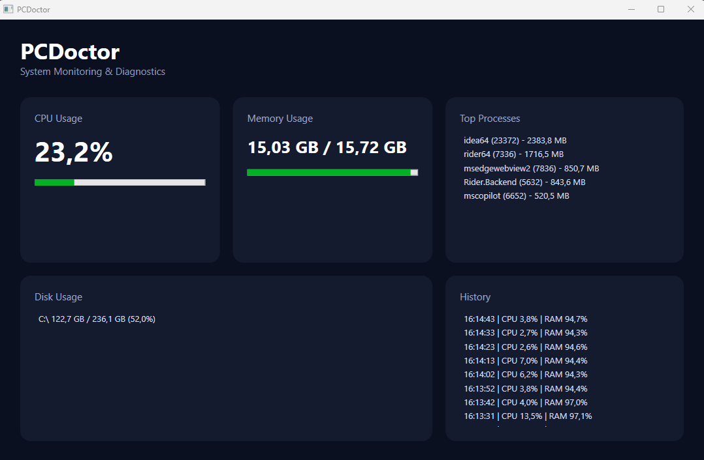
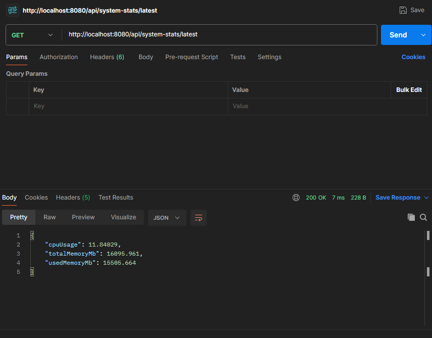
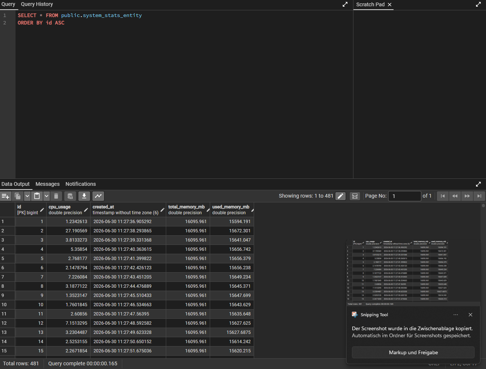

# PCDoctor – System Monitoring & Diagnosis Platform

PCDoctor is a desktop-based system monitoring application built with C#, WPF, Java Spring Boot, REST APIs, and PostgreSQL.

The application monitors system resources such as CPU usage, memory usage, disk usage, and running processes in real time. The collected data is displayed in a modern WPF dashboard and sent to a Spring Boot backend for persistence and further analysis.

## Features

* Real-time CPU monitoring
* Real-time RAM monitoring
* Disk usage overview
* Top running processes by memory usage
* Modern WPF dashboard
* Java Spring Boot REST API
* PostgreSQL persistence
* History endpoint for stored system statistics
* Basic diagnostic warnings for high CPU and memory usage

## Architecture

PCDoctor consists of three main parts:

* **PCDoctor.UI** – WPF desktop application
* **PCDoctor.Core** – C# core monitoring logic
* **pcdoctor-api** – Java Spring Boot backend

Data flow:

WPF Client → C# Core → REST API → Spring Boot Backend → PostgreSQL

## Technologies

* C#
* .NET / WPF
* Java
* Spring Boot
* REST APIs
* PostgreSQL
* Spring Data JPA
* Git

## API Endpoints

### Send system statistics

POST `/api/system-stats`

### Get latest statistics

GET `/api/system-stats/latest`

### Get history

GET `/api/system-stats/history`

### Get diagnostics

GET `/api/system-stats/diagnostics`

## Database

The backend stores system statistics in PostgreSQL using Spring Data JPA.

Example stored values:

* CPU usage
* Used memory
* Total memory
* Timestamp

## Setup

1. Install PostgreSQL.
2. Create a database named `pcdoctor`.
3. Set the environment variable `DB_PASSWORD` with your PostgreSQL password.
4. Start the Spring Boot backend.
5. Start the WPF application.

## Screenshots

### Dashboard

### API Response

### PostgreSQL Data

## Project Status

This project is currently in development and is used as a portfolio project to demonstrate desktop development, backend development, REST communication, database integration, and clean software architecture.
