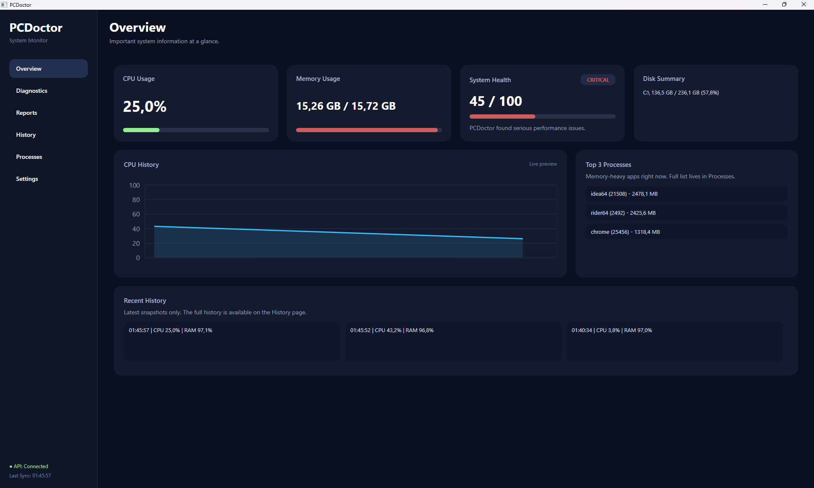
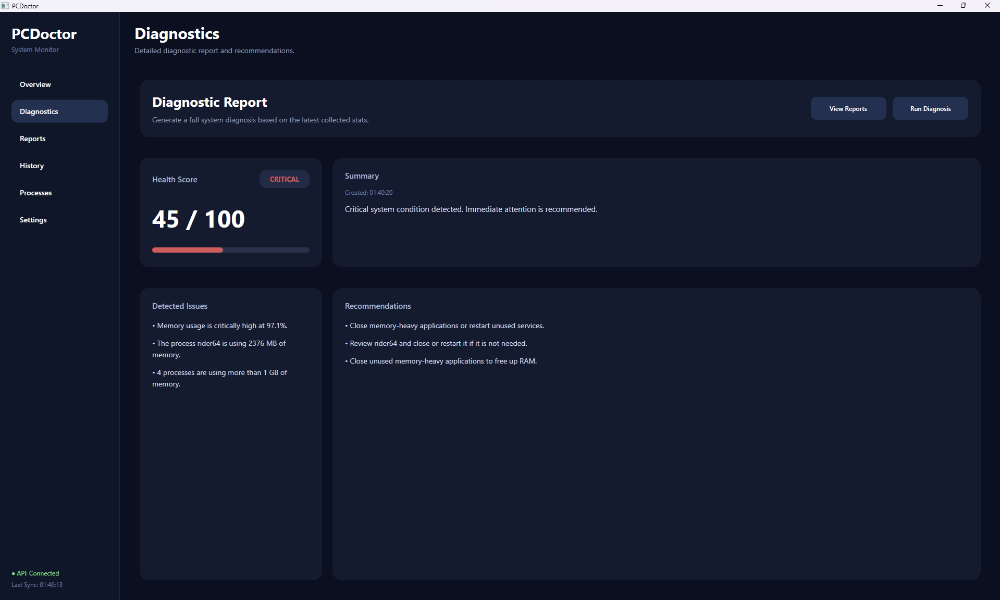
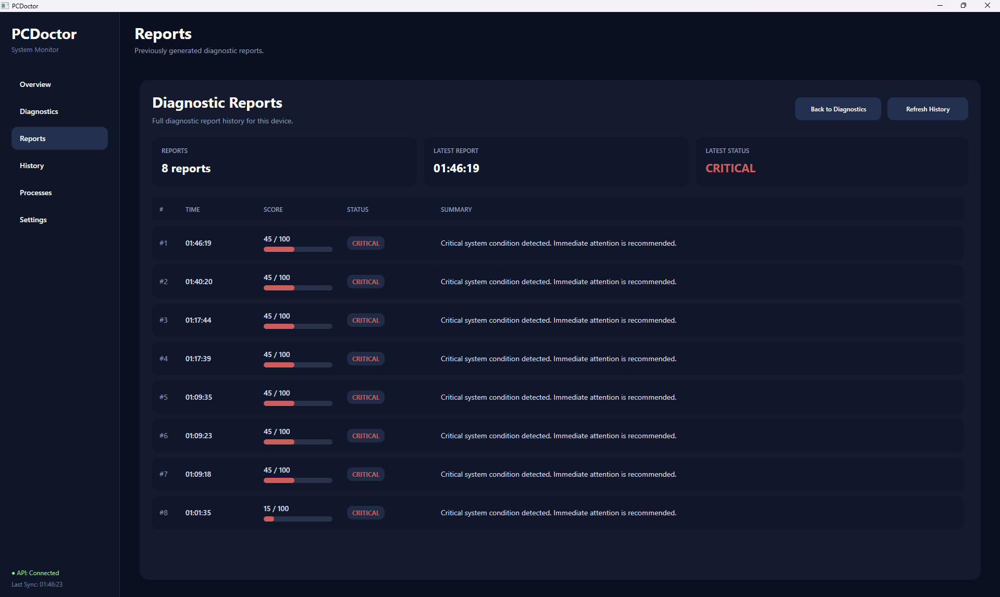
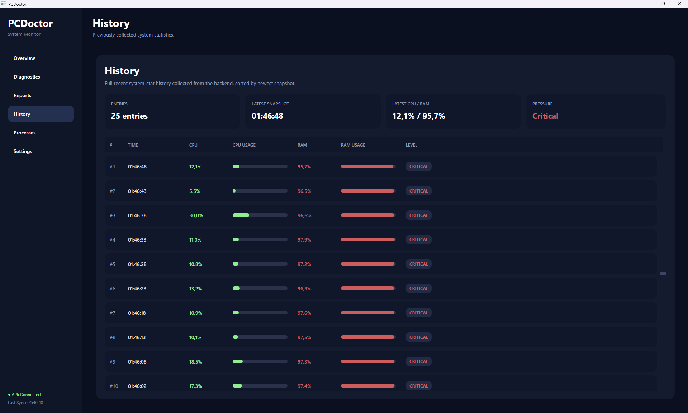
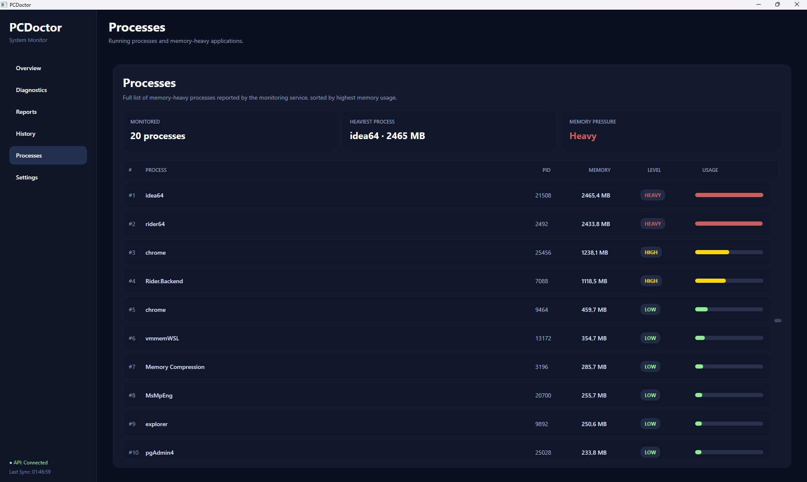
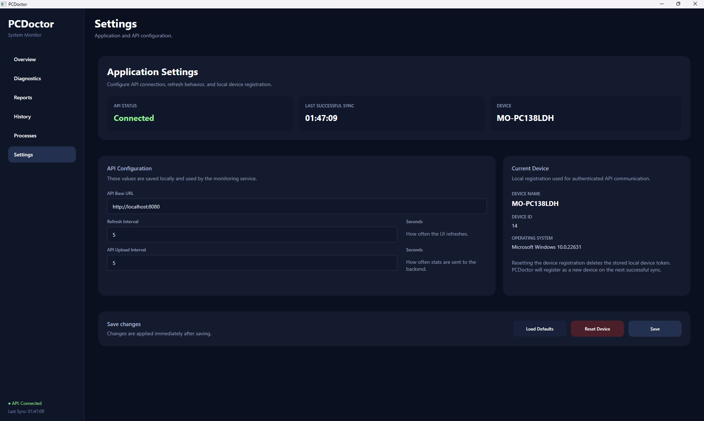
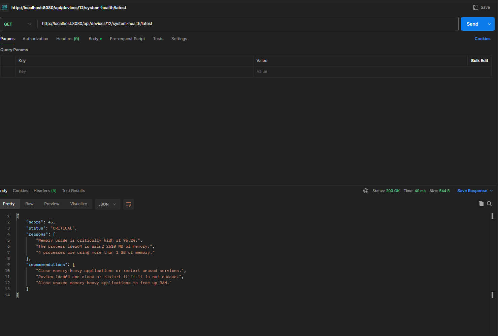
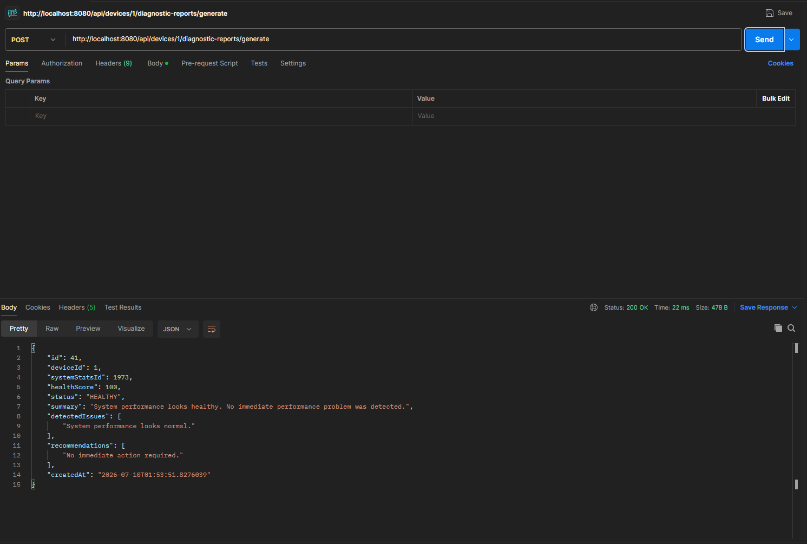
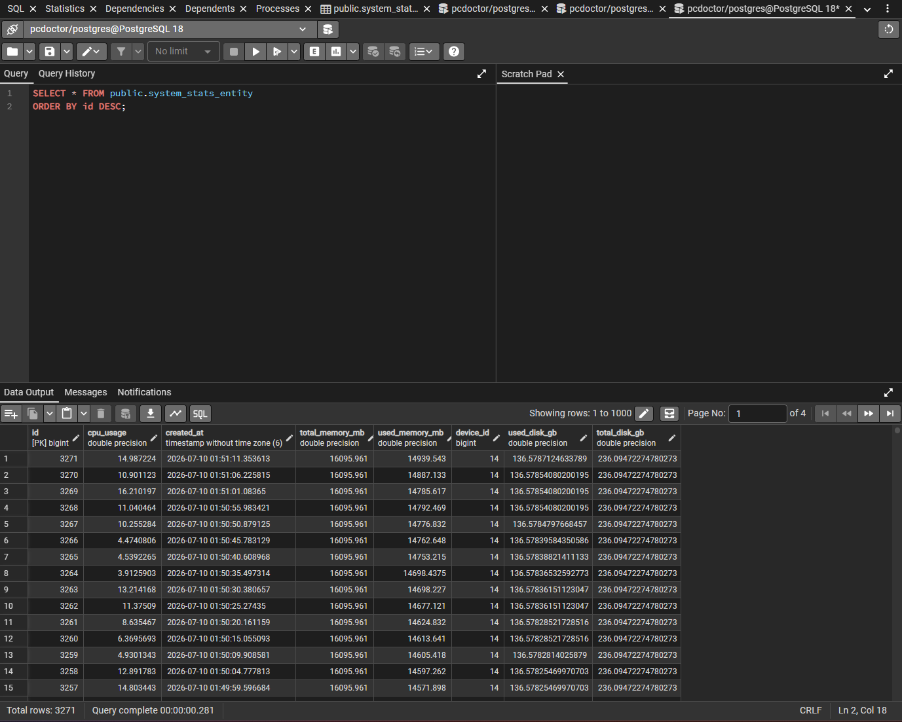
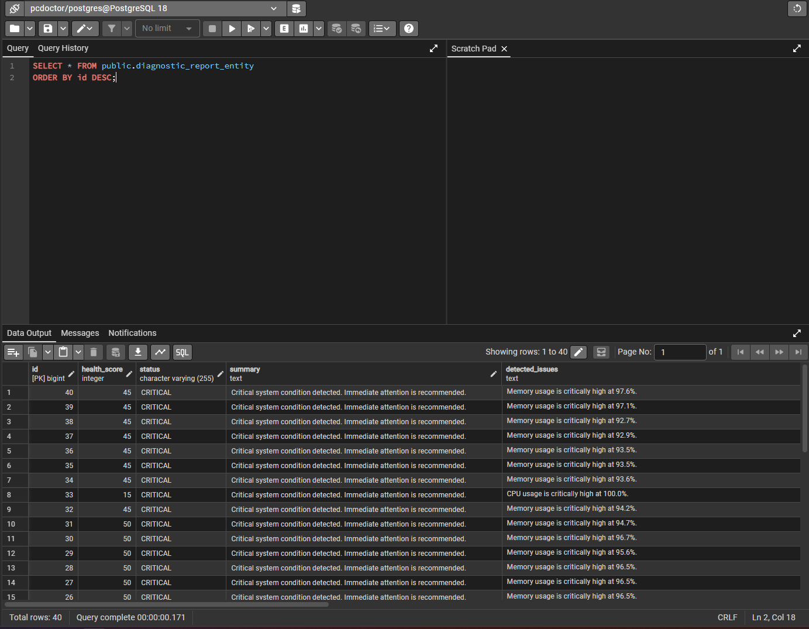

# PCDoctor – System Monitoring & Diagnostics Platform

PCDoctor is a full-stack system monitoring and diagnostics application built with **C#**, **WPF**, **Java Spring Boot**, **REST APIs**, **PostgreSQL**, **Flyway**, and **Docker**.

The application monitors system resources such as CPU usage, memory usage, disk usage, and running processes in real time. The collected data is displayed in a modern WPF desktop application and synchronized with a Spring Boot backend for persistence, historical analysis, health evaluation, and diagnostic report generation.

---

## Features

- Real-time CPU monitoring
- Real-time memory monitoring
- Disk usage overview
- Running process analysis
- Top processes by memory usage
- Live CPU history chart with LiveCharts2
- Modern WPF sidebar navigation
- MVVM-based desktop architecture
- Dedicated pages for:
    - Overview
    - Diagnostics
    - Reports
    - History
    - Processes
    - Settings
- Configurable refresh interval
- Configurable API synchronization interval
- Device registration with device token authentication
- Java Spring Boot REST API
- PostgreSQL persistence
- Flyway database migrations
- Historical system statistics
- System health evaluation
- Diagnostic report generation
- Diagnostic report history
- Health score calculation
- Detected issues and recommendations
- Docker support for backend and database
- Structured logging with Serilog

---

## Architecture

PCDoctor consists of three main parts:

```text
PCDoctor.UI
│
├── WPF Desktop Application
├── MVVM Architecture
├── Sidebar Navigation
├── LiveCharts2 Dashboard
├── Page-specific ViewModels
└── REST Client

        │
        ▼

PCDoctor.Core
│
├── System Monitoring
├── Process Collection
├── API Communication
├── Device Registration
├── Business Logic
└── Monitoring Services

        │
        ▼

pcdoctor-api
│
├── Java Spring Boot REST API
├── REST Controllers
├── Service Layer
├── Spring Data JPA
├── Flyway Migrations
└── PostgreSQL Database
```

---

## Data Flow

```text
System Resources
        │
        ▼
PCDoctor.Core Monitoring Services
        │
        ▼
WPF Desktop UI
        │
        ▼
Spring Boot REST API
        │
        ▼
PostgreSQL Database
        │
        ▼
History, Health Evaluation & Diagnostic Reports
```

---

## Technologies

### Frontend

- C#
- .NET
- WPF
- MVVM
- LiveCharts2
- Serilog

### Backend

- Java 17
- Spring Boot
- Spring Data JPA
- REST API
- Flyway

### Database

- PostgreSQL

### DevOps

- Docker
- Docker Compose
- Git

---

## REST API

### System Statistics

Store system statistics:

```http
POST /api/system-stats
```

This endpoint uses a device token header:

```http
X-Device-Token: <device-token>
```

Get system statistics history for a device:

```http
GET /api/devices/{deviceId}/system-stats/history
```

Get diagnostic messages for a device:

```http
GET /api/devices/{deviceId}/system-stats/diagnostics
```

---

### System Health

Get the latest system health evaluation for a device:

```http
GET /api/devices/{deviceId}/system-health/latest
```

---

### Diagnostic Reports

Generate a diagnostic report:

```http
POST /api/devices/{deviceId}/diagnostic-reports/generate
```

Get latest diagnostic report:

```http
GET /api/devices/{deviceId}/diagnostic-reports/latest
```

Get diagnostic report history:

```http
GET /api/devices/{deviceId}/diagnostic-reports/history
```

---

## Database

PCDoctor stores system monitoring data and diagnostic reports in PostgreSQL.

Stored system statistics include:

- CPU usage
- Used memory
- Total memory
- Disk usage
- Top processes
- Timestamp

Stored diagnostic reports include:

- Device reference
- System stats reference
- Health score
- Status
- Summary
- Detected issues
- Recommendations
- Creation timestamp

Database schema changes are managed with **Flyway migrations**.

---

## Project Structure

```text
PCDoctor
│
├── PCDoctor.UI
│   ├── Views
│   ├── ViewModels
│   ├── Commands
│   ├── Services
│   └── Models
│
├── PCDoctor.Core
│   ├── Services
│   ├── Models
│   └── Monitoring
│
├── pcdoctor-api
│   ├── controller
│   ├── service
│   ├── entity
│   ├── repository
│   ├── dto
│   └── db/migration
│
├── screenshots
├── docker-compose.yml
└── README.md
```

---

## Screenshots

### Overview



### Diagnostics



### Diagnostic Reports



### System Stats History



### Processes



### Settings



### System Health API



### Diagnostic Report API



### System Stats History API


### PostgreSQL System Stats Table



### PostgreSQL Diagnostic Reports Table



---

## Getting Started

### Prerequisites

- .NET SDK
- Java 17+
- Docker Desktop
- PostgreSQL client or database tool
- Rider or Visual Studio

---

### Clone the repository

```bash
git clone https://github.com/<your-username>/PCDoctor.git
cd PCDoctor
```

---

### Configure environment variables

Create a `.env` file in the project root:

```env
DB_PASSWORD=your_password
```

---

### Start PostgreSQL and Backend

```bash
docker compose up -d --build
```

---

### Run the WPF Application

Open the solution in Rider or Visual Studio and start:

```text
PCDoctor.UI
```

---

## Current Project Status

PCDoctor is currently a working full-stack portfolio project.

Implemented:

- WPF monitoring dashboard
- Sidebar-based desktop UI
- Modular MVVM structure
- Live CPU and memory monitoring
- Disk usage overview
- Process monitoring
- System stats history
- Spring Boot backend
- PostgreSQL persistence
- Flyway migrations
- Device-based API structure
- Device token authentication for stats upload
- System health evaluation
- Diagnostic report generation
- Diagnostic report history
- API/backend integration

Planned improvements:

- Unit tests
- Better error handling
- More detailed process diagnostics
- More advanced health scoring
- CI/CD pipeline
- Application installer
- Additional UI polish

---

## Learning Goals

This project demonstrates practical experience with:

- Desktop application development with WPF
- MVVM architecture
- Clean separation of concerns
- REST API communication
- Java Spring Boot backend development
- PostgreSQL persistence
- Flyway database migrations
- Docker-based local development
- Full-stack application architecture
- Monitoring and diagnostics logic
- Git-based project workflow